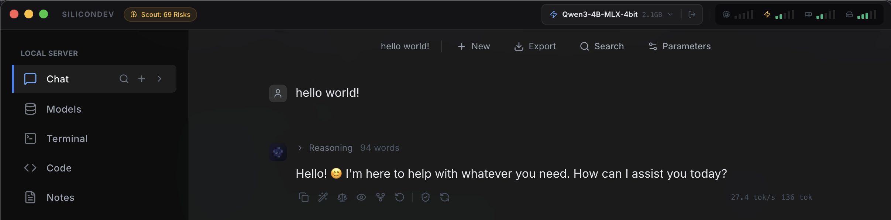

# SiliconDev

**Local LLM fine-tuning and chat for Apple Silicon.**


[](https://github.com/fabriziosalmi/silicondev/actions/workflows/ci.yml)
[](https://opensource.org/licenses/MIT)
-black)


[Download DMG](https://github.com/fabriziosalmi/silicondev/releases/latest) · [Documentation](https://fabriziosalmi.github.io/silicondev/) · [Report Bug](https://github.com/fabriziosalmi/silicondev/issues)

SiliconDev is a desktop app for running, fine-tuning, and chatting with LLMs on your Mac. It uses Apple's [MLX](https://github.com/ml-explore/mlx) framework so everything runs on-device — no cloud, no API keys, no data leaves your machine.

<p align="center">
  
</p>



## Why SiliconDev?

- **Runs entirely on your Mac.** No cloud accounts, no API keys, zero telemetry. Your data stays local.
- **Fine-tuning built in.** LoRA and QLoRA training directly on Apple Silicon, with real-time loss curves.
- **One app, not six.** Data prep, model management, training, chat, RAG, MCP tools, and an agent terminal in a single window.

## Quickstart

```bash
git clone https://github.com/fabriziosalmi/silicondev.git && cd silicondev
make setup
make run
```

Requires macOS 13+, Apple Silicon (M1/M2/M3/M4), Node.js 18+, and Python 3.10+.

<details>
<summary>Manual setup (without Make)</summary>

```bash
git clone https://github.com/fabriziosalmi/silicondev.git
cd silicondev

# Frontend
npm install

# Backend
cd backend
python -m venv .venv && source .venv/bin/activate
pip install -c constraints.txt -e ".[dev]"
cd ..

# Run
npm run dev
```
</details>

## Features

### Chat
Local ChatGPT-like interface, fully offline. Vision model support with image attachments. Conversation branching, in-chat search (Ctrl+F), quick actions (rewrite, translate, self-critique), RAG knowledge injection, web search, syntax validation, PII redaction.

### Fine-Tuning
LoRA / QLoRA with visual configuration. Real-time loss curves, configurable hyperparameters, LoRA rank/alpha/dropout/layers. DPO preference training: every diff approve/reject is captured as a training pair, with a dedicated tab to launch DPO jobs directly on MLX.

### Data Preparation
Preview and edit JSONL/CSV datasets. PII redaction via Presidio. CSV-to-JSONL conversion with chat templates. MCP-based dataset generation.

### Model Management
Browse and download models from Hugging Face. 4-bit / 8-bit quantization. Load, switch, and export models. Scan local directories (LM Studio, Ollama, HF cache).

### RAG Knowledge
Create document collections with chunk-based retrieval. Toggle per-conversation RAG context injection.

### MCP Integration
Add stdio-transport MCP servers. Discover and test tools. Generate fine-tuning data from tool schemas.

### Code Workspace
Monaco-based editor with an agentic panel powered by the NanoCore supervisor agent. Open a folder, ask it to edit or create files, and review diffs before they are applied.
- **NanoCore Agent**: Tools: `read_file`, `edit_file`, `patch_file`, `run_bash`, `spawn_worker`. Generates diffs, waits for approval before writing.
- **Mixture of Agents (MoA)**: Parallel sub-agents (Security, Performance, Syntax) that review the proposed changes.
- **Subagent Workers**: Delegate focused tasks (code review, test writing, docs, bug fixing) to independent workers with their own context and tool subsets.
- **Model Routing**: Assign different models to different roles (planner, coder, reviewer). The supervisor picks the right model per phase.
- **Live Preview**: Start a dev server (Vite, Next.js, Flask, static HTML) directly in the editor. Auto-detects project type, picks a free port, renders in an iframe with resize handle.
- **Self-Healing**: Detects bash failures and retries up to 3 times; escalates to the user if stuck.
- **Air-Gapped Mode**: Blocks outbound network calls during agent runs.
- **Python Sandbox**: Isolated subprocess execution for scripts.
- **Plan Mode**: `/plan <task>` for multi-file structured edits with a review step.

### Terminal
Direct bash execution with streaming output. Runs shell commands via a PTY and streams stdout/stderr as SSE.

### Knowledge Graph
SQLite-backed graph of nodes and edges extracted from conversations. Stores facts, decisions, and file references. Browsable via the Knowledge Map panel (`Alt+Shift+K`). Scout Agent runs in the background and flags high-activity files as refactoring candidates.

### Training Orchestrator
Triggers local fine-tuning jobs via `mlx-lm` subprocess. Configurable base model, dataset path, adapter output directory, epochs, batch size, and learning rate. Status and output accessible through the `/api/training` endpoints.

### Notes
Markdown editor with live preview, multi-note management, send to chat.

### Command Palette
Keyboard-driven action launcher (`Alt+Shift+P`). Provides quick access to tab navigation, Knowledge Map, and training actions.

## Development Status

SiliconDev is pre-v1.0 software. Some features — **Terminal**, **Code Workspace**, and **Notes** — are in active development and may change significantly between releases.

If you run into bugs or rough edges, please [open an issue](https://github.com/fabriziosalmi/silicondev/issues). Every report in these early stages is extremely valuable and helps shape the app.

**v1.0.0 will not be released until all current features are solid and fully polished.**

## Limitations

- **macOS only.** Requires Apple Silicon (M1 or later). No Intel, no Linux, no Windows.
- **No CUDA.** This is MLX-only. If you have an NVIDIA GPU, use a different tool.
- **Large models need RAM.** 7B models need ~8 GB free. 30B+ models need 32+ GB.

## Tech Stack

- **Frontend**: Electron, React 19, TypeScript, Vite, TailwindCSS
- **Backend**: Python 3.12+, FastAPI, Uvicorn
- **Inference**: Apple MLX, MLX-LM, MLX-VLM (prefix caching, KV quantization, disk KV cache, speculative decoding)
- **Data**: Pandas, Presidio, MCP SDK
- **Memory**: SQLite (Knowledge Graph), BM25 + HNSW (search/RAG)
- **Monitoring**: psutil, platform-native GPU stats

## Contributing

See [CONTRIBUTING.md](CONTRIBUTING.md) for setup, architecture overview, and how to submit a PR.

## License

MIT License. See [LICENSE](LICENSE) for details.

## Attribution

Based on [Silicon-Studio](https://github.com/rileycleavenger/Silicon-Studio) by [Riley Cleavenger](https://github.com/rileycleavenger).
